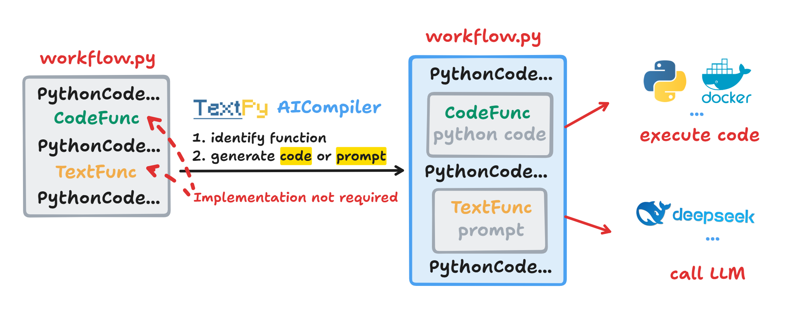

<p align="center">
  <picture>
    
  </picture>
</p>

# TextPy ── Collaborative Agent Workflow through Programming and Prompting

### 🚀 Core Philosophy

```
P1: Workflow = Programming + Prompting
P2: Programming <-> Prompting
P3: Workflow = Function Signature with Comment
```


### ⚡ Revolutionary Features
- **Mixed-Execution**: Seamlessly integrates with legacy code
- **AICompiler**: Just write function signatures -- our powerful compiler will automatically generate natural language instructions or code instructions just in time
- **Self-Replication**: Easier implementation of recursive workflows

### 🔧 Usage

#### Installation
Install via pip:
```bash
$ pip install textpy-llm
```
Import in your Python script:
```python
import textpy
```
Or use our Docker image:
```bash
$ docker pull ghcr.io/yezhengmao1/textpy:latest
```

### 🧠 How to Work



* Use decorators to mark the functions you need to compile (these functions do not need to be implemented)
* **TextPy** will identify their functionality and generate code or prompts for them
* During execution, the code is executed by a code execution virtual machine (Python), while prompts are executed by a prompt execution virtual machine (LLM)

### 🦄 Quick Start

```python
# When calling the function, TextPy will read the context,
# and the AICompiler will auto-generate the code for the CodeFunc.
# The CodeFunc will run in the Python interpreter by default.
@code(
  # Default parameters are as follows
  # model name, ref: litellm
  model: str = "deepseek/deepseek-chat",
  # the api key
  api_key: Optional[str] = None,
  # base url for api
  base_url: Optional[str] = None,
  # if not None, the generated code will not be changed
  cache: Optional[str] = ".cache",
  # if not None, the provided code will be executed
  code: Optional[str] = None,
  # provide some package's information to assist in code generation
  pypi_package: Optional[str] = None,
)
def python_code(*, paramters: Type) -> Type:...

# When calling the function, TextPy will read the context,
# and the AICompiler will auto-generate the prompt for the TextFunc.
# The TextFunc contains a prompt that implements the function's role and will call a large language model (LLM) for results.
@code(
  # Default parameters are as follows
  model: str = "deepseek/deepseek-chat",
  api_key: Optional[str] = None,
  base_url: Optional[str] = None,
  cache: Optional[str] = ".cache",
  # if not None, the provided prompt will be used
  prompt : Optional[str] = None,
)
def llm_prompt(*, paramters: Type) -> Type:...
```

### 👾 Quick Start - Amazing Example - Daily arXiv

**Example**: Automatically fetch daily updates from arXiv, filter papers by topic, translate abstracts into Chinese, store them in a database, and generate a markdown file to display the abstracts.

😊**Real-world Use Case**: I personally use **TextPy** to periodically push these generated markdown files to my blog when new papers are available.

Browse the results at: [Daily arXiv](https://yezhem.com/docs/Daily%20arXiv/)

**Highlight**: You only need to define the functions and use them in your workflow. Our powerful **AICompiler** recognizes their purpose, automatically generating and executing the necessary code or creating prompts for large language model interaction.

see `examples/daily_arxiv.py` for the complete implementation.

```python
@code
def get_the_rss_xml_file_str(*, url: str) -> str: ...

@code(pypi=[get_the_rss_xml_file_str(url=ARXIV_URL)])
def get_all_item_in_the_rss_file(*, xml_file_str: str) -> list[dict]: ...

@text
def check_topic_is_satisfactory(*, abstrct: str, topic: str) -> bool: ...

@text
def translate_the_en_abstract_to_zh(*, abstract: str) -> str: ...

@code
def check_link_in_db(*, db_path: str, link: str) -> bool: ...

@code
def save_article_to_db(*, db_path: str, item: dict): ...
# These functions only need to be defined...
```

### 🤩 Quick Start - Awesome Example - Deep Paper

**Example**: Download PDFs from arXiv using their IDs, extract text, generate summaries, and recursively process all cited references. The system visualizes the relationships between papers in an interactive HTML file.

**Highlight**: All functions in the workflow is generated by **TextPy**'s **AICompiler**, including installation and usage of external Python packages. Your only responsibility is writing function signatures with clear comments, and the workflow!

**NOTE**: We strongly recommend running this script in a container since the **AICompiler** manipulates the external environment during compilation.

To run with Docker:
```bash
cd ./examples
DEEPSEEK_API=xxx CACHE_DIR="/workspace/.cache" ARXIV_ID=<xxxx.xxxx> ./arxiv_search.sh
```

See It In Action:

<p align="center">
  <a href="https://www.youtube.com/watch?v=6EfpRPkiUVk">
    
  </a>
</p>


### 📌 Contributing
Community contributions are more than welcome, whether it be to fix bugs or to add new features at github.

### 📜 Citation
```latex
@misc{ye2025textpy,
  title = {TextPy: Collaborative Agent Workflow through Programming and Prompting},
  howpublished = {\url{https://github.com/yezhengmao1/TextPy}}
  year = {2025},
}
```